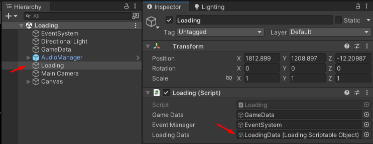
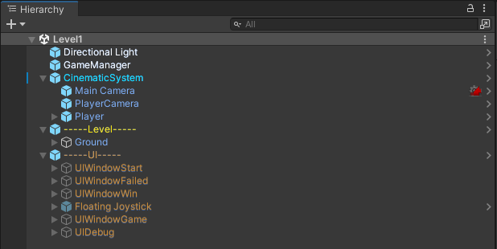
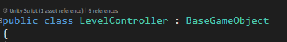
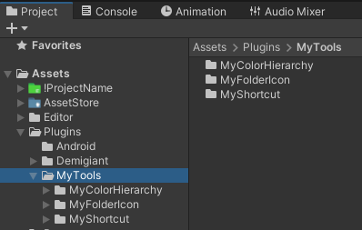

# NewProject
Задача проекта ускорить разработку HyperCash игры, на создание которых обычно дается 2 недели.
*Решил сделать проект публичным.*

Проект шаблон Core для быстрого старта новых проектов HyperCash. В этот проект я переношу фишки из других реализованных проектов если вижу, что они могут ускорить работу или позволить вспомнить реализацию давно не используемого функционала.

В этом проекте допустимы блоки с кодом, отключенные т.к. не будут работать, например код для покупок GooglePlay, встроенная реклама или аналитика. Т.к. этот блок кода представляет собой шаблон для реализации подобного.

В этом проекте допустимы смешанные стили кода т.к. стиль кода меняется с новыми проектами выбирая лучший вариант, а старые части проекта не переписываются т.к. это шаблоны логики.

Некоторый функционал может расширяться или переписываться, если в каком-то рабочем проекте найдено более удобное решение.

## Базовая структура лучше всего подходит для HyperCash 

### Организация папок:

!ProjectName - папка проекта, с ресурсами необходимыми для проекта
!LevelConstructor - объекты которые располагаются в каждой сцене и требуют частого доступа к префабам
Art - объединяется в себе организацию проекта необходимую для дизайнера
AssetStore - содержит все, что загружаем из AssetStore если это можно перенести из корня проекта, иначе "плохой пакет" остается в корне засоряя структуру.


### Структура сцен для проектов создаваемых в 1-3 человека:

Loading - стартовая точка, представляет собой экран загрузки с переходом на нужную сцену
Prototip - сцена для разработки прототипа и экспериментов 
LevelART - сцена для экспериментов дизайнера, где он ничего в проекте не сломает
LevelForCopy - сцена шаблон, содержит базовую структуру копируемую для создания нового уровня игры
Level1 - готовая сцена игры (первый уровень)


### Настройки запуска проекта:

- IsResetProgress - при запуске проекта будут сброшены сохранения и произойдет запуск первого уровня игры
- IsDebug - может использоваться для включения часто необходимого лога игры и быстрого отключения 
- IsCPIVideo - опция, для настройки проекта под запись CPI ролика, ниже могут быть настройки которые крутит ГД для лучшего кадра
- IsLoadArt - опция запустить игру со сцены для тестов дизайнера
- IsLoadForCopy - опция запустить игру со сцена шаблона для уровней игры
- IsLoadPrototip - запустить игру со сцены прототипа
- IsLoadCPI - запустить сцену из опции NameCPILevel
- IsLoadLastPlay - запустить ту сцену на которой была запущена игра в редакторе Unity 

(Если все опции сняты, то запуск происходит как для релиза, сцена берется из сохранений или Level1)

- lastPlayScene - используется для сохранения последней запущенной сцены
- MaxLevels - количество уровней в игре, после чего будет запуск уровней по кругу или конец игры (решает ГД)




### Структура игровой сцены:

Все игровые сцены имеют одинаковые объекты и общую логику работы.

- GameManager - управляет запуском, перезапуском, потерей фокуса игры, предоставляет доступ к GameData.
- CinematicSystem - содержит набор камер и синемашину, основная камера PlayerCamera содержит CameraController. Т.к. игрок в 90% случаев связан со своей камерой, в этом префабе также содержится игрок Player.
- Player - игрок, содержит PlayerController объединяющий все действия с игроком.
- -----Level----- - уровень, содержит в себе мир, настройки уровня и LevelController.
- -----UI----- - интерфейс игры, содержит в себе окна управляемые через UIManager.

При старте GameManager проверяет корректность загрузки сцены, после чего запускает инициализацию уровня LevelController. LevelController инициализирует объекты игры, сообщает для самостоятельных объектов, что сцена проинициализирована и показывает стартовый интерфейс через UIManager. PlayerController активируется через LevelController когда должна быть запущена игра. FloatingJoystick - UI джойстик для Touth управления на устройствах Android/IOS.



## Фишки:

### BaseGameObject

Базовый класс BaseGameObject объектов игры с ленивыми ссылками на основные компоненты. Заменяет использование DI предоставляя абсолютно неприхотливую связанность компонентов. Каждый игровой объект наследуется от BaseGameObject получая доступ к:

- GM - GameManager
- Player - PlayerController
- Level - LevelController
- UI - UIManager
- J - joystick
- Camera - CameraController
- Audio - AudioManager




### EventManager

Система событий игры, не требует слежения за подписками и отписками, что сильно ускоряет процесс разработки. И позволяет в VisualStudio быстро найти все места использования события.

Компонент наследованный от BaseGameObject, при активации isEventCheck = true становится слушателем событий GetAction(int ID, object obj, object obj2).

Пример из игры DoctorHands:


### Constants

Класс для хранения констант используемых в разных частях проекта, например для PlayerPrefs. Иногда требуется обойти систему сохранений GameData.


### GameData

Система хранения игровых данных, также включает функционал сохранения и загрузки данных в файлы. Доступ предоставляется для объектов BaseGameObject через GM (GameManager).

Имеет структуру:

PlayerData - данные игрока, как правило сохраняются между запусками игры.
LevelData - данные уровня, как правило будут стерты при запуске или перезапуске сцены уровня.
HighScoresData - фишка для рейтинга, вынесено в отдельный блок данных.
DataBase - база данных игры (содержит ссылки на ресурсы игры с помощью ScriptableObject), о ней расскажу позже.


### HighScoresData

Фейковая таблица рейтинга игры, очень часто нужно в игру встроить рейтинг. Данная таблица генерируется один раз при запуске приложения на устройстве. После чего игрок поднимается по таблице рейтинга получая очки за игру, побеждая таким образом сгенерированные имена фейковых игроков.

Пример из моей игры про изучения слов **BrainTranslator**:


### DataBase

Доступна для компонентов наследованных от BaseGameData через GM.GameData. В данном приложении содержит ссылки примеры. В этом подходе прекрасно то, что мы всегда имеем ссылку на допустим префаб или звук или картинку, но она не загружается в память при старте сцены, как если бы мы привязали объект напрямую к компоненту. И т.к. структура игры подразумевает множество сцен и перезапуск текущей сцены при необходимости. Все что мы загрузили через БД для прошлой сцены удаляется сборщиком мусора пока не понадобится в новой сцене. Обеспечивая элементарный доступ, контроль памяти и люблю эту тему использование стандартного функционала Unity исключая зависимости от сторонних разработок.

- DataBase - входная точка базы данных
- loadingData - настройки запуска игры
- PrefabsData - ссылки на префабы, позволяет упростить связанность не создавая публичные ссылки на префабы из компонентов.
- VFXData - ссылки на визуальные эффекты


Пример БД из проектов BrainTranslator и SniperSuss:


### IAPManager

Менеджер висит на объекте GameManager. В данном проекте это чистой воды шаблон для ускорения создания внутренних покупок. Проект Puppy к сожалению не был выпущен в GooglePlay, но в него были сразу встроены внутриигровые покупки. 

[Проект Puppy (Необходим VPN)]: https://itch.io/queue/c/3687541/vladimir-shangeev-collection?game_id=2318329

### AdsManager

Шаблон для подключения показа рекламы. Опыт показал, что один проект может метаться между разными системами показа рекламы, их будет удобно отключать и включать в отдельном менеджере с базовыми вызовами показа рекламы встроенными в процесс игры.

Просто вставляем в завершение сцены вызов с калбэком после показа рекламы для перехода на другую сцену

```c#
OnShowInterstitialAds_ChangeLevel(() => {GM.OnStartNextLevel()}));
```

### CameraController

Имеет функцию настройки Fog и SkyBox, что очень полезно когда у вас много сцен и Арт вдруг решил везде поменять окружение.

Опция ОffPostProcessDevice - очень удобная для теста проекта без навешанных пост процессов, очень часто бывало такое, что проект почти готов и вдруг начал тормозить, опция позволяет быстро собрать проект отключив идеологию Art и проверить FPS на устройстве убедившись, что проблема не в коде.

Для доступа к базовой камере используется ссылка Camera.main, Camera.transform - будет означать взять позицию с объекта PlayerCamera управляемого синемашиной.

CameraAutoSize() - пригодится когда на устройствах разное разрешение и надо подогнать Fov камеры чтобы объекты видимые при идеальном разрешении не скрывались за краем экрана на нестандартном разрешении. 

TeleportInNewPos() - у синемашины есть неудобство, она не умеет моментально менять позицию, поэтому была придумана такая функция в CameraController.

Shock() - пример включения тряски камеры используя синемашину. (Не помню в какой игре это применялось)

### UIManager

Управляет окнами, каждое окно должно быть наследовано от UIWindow и будет иметь доступ к ленивым ссылкам. В инспекторе также настраивается базовое поведение окон:

- IsOnPausedGame - при показе окна автоматически включать паузу в игре
- IsOnPlayGame - при показе окна автоматически снимать паузу
- IsNotClosed - окно не будет закрыто автоматически при показе другого окна


### StatusManager

Если игра требует что редко работать с состояниями игры, можно использовать данный менеджер с заготовленными базовыми статусами. Как правило это не требуется и я уже не помню в каком проекте использовал этот функционал.


### MyTools

Переработанные или доработаны мной, для удобства разработки проектов.



MyColorHierarchy - тулза для раскраски иерархии, скрипт навешивается на GameObject сцены чтобы выделить его в сцене.


MyFolderIcon - тулза для раскраски папок проекта, настраивается иконками в папке Icons, для определенного названия папки, можно создать иконку которая будет применяться для всех папок с таким названием.


MyShortcut - тулза для быстрого доступа к объектам. Открыть окно можно через меню Tools/MyShortcut. Далее в появившееся окошко в поле "Добавить ссылку" переносите из Project сцены, картинки, папки (все к чему необходимо часто обращаться). По клику на добавленный объект вы в разблокированном окне Project сразу выделите нужный элемент. 


# Заключение.

На этом HyperCash Core, с модификациями выпущено множество проектов компании DigitalPill. А также много проектов не выпущены не пройдя CPI.

Проекты где всегда разные механики и короткий срок разработки (команда трех):
https://play.google.com/store/apps/details?id=games.dpill.sniperjohn
https://play.google.com/store/apps/details?id=games.dpill.sword
https://play.google.com/store/apps/details?id=games.dpill.mechrun
https://play.google.com/store/apps/details?id=games.dpill.housecrusher
https://play.google.com/store/apps/details?id=games.dpill.doctorhandsrun
https://play.google.com/store/apps/details?id=games.dpill.gunheadslide
https://play.google.com/store/apps/details?id=games.dpill.moneyjump
https://play.google.com/store/apps/details?id=games.dpill.mergeswordcraft
https://play.google.com/store/apps/details?id=games.dpill.moneypush
https://play.google.com/store/apps/details?id=games.dpill.dzenorigami
https://itch.io/queue/c/3687541/vladimir-shangeev-collection?game_id=2318329
https://play.google.com/store/apps/details?id=games.dpill.jellysort

Коллекция проектов, где применяются мои наработки:
https://itch.io/c/3687541/vladimir-shangeev-collection

*Вроде про все фишки Core рассказал, если понравился шаблон или что-то забыл описать, можете мне сообщить в телеграмм:* @Deliankur

